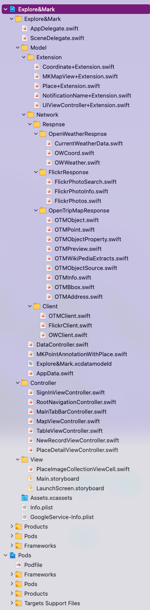

# Explore&Mark

## Description

This is an iOS App that allow user to explore the interesting place around his/her location or any location the user want to explore, and also enable user to mark his/her explore records

## Requirement

- iOS 10.0+ 
- Xcode 11+
- Swift 5.1+

## Tech Stack

- Swift
    - UIKit
    - MapKit
    - CoreData
    
 - Firebase
    - Realtime Database
    - Authentication

- Thrid-party APIs
    - OpenTripMap
    - Flickr
    - OpenWeather

- HTTP Request
    - Alamofire
    
## Project Structure

General Speaking, this project follows MVC pattern. At the moment this doucment get updated. The project structure looks as following

  
